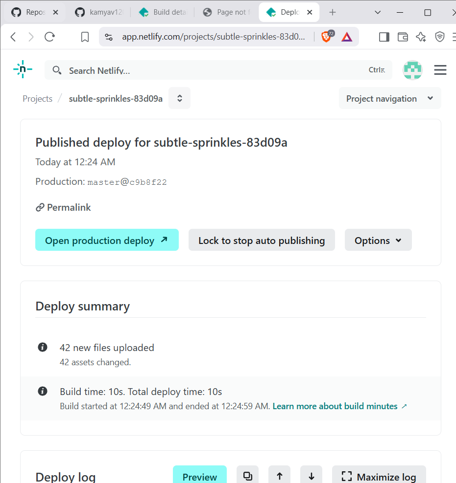
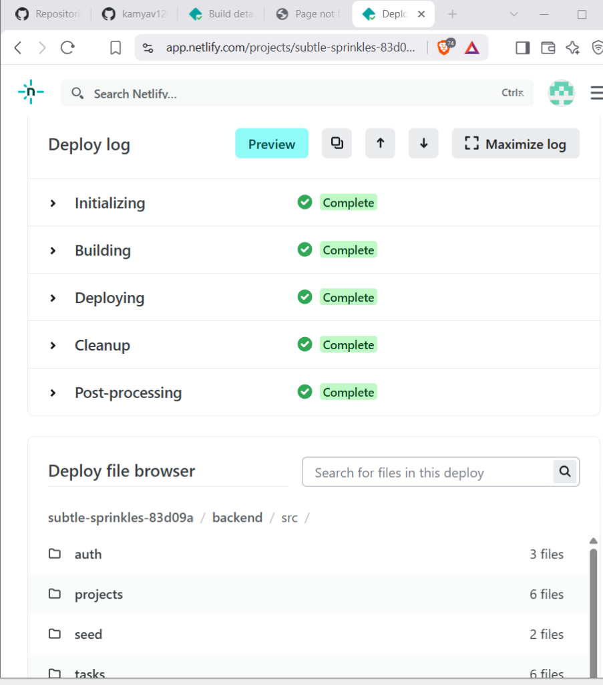
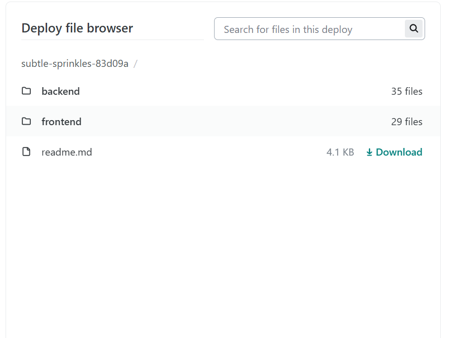
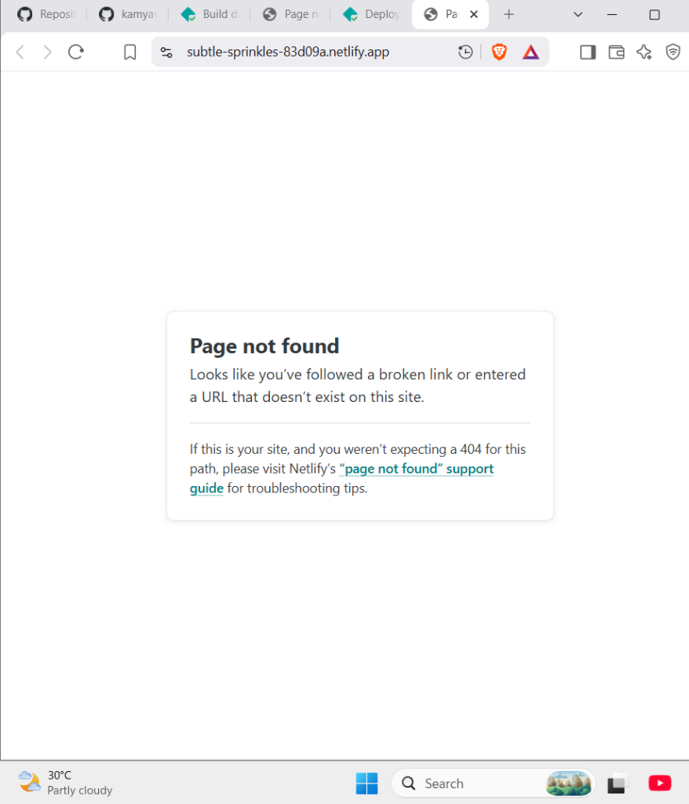
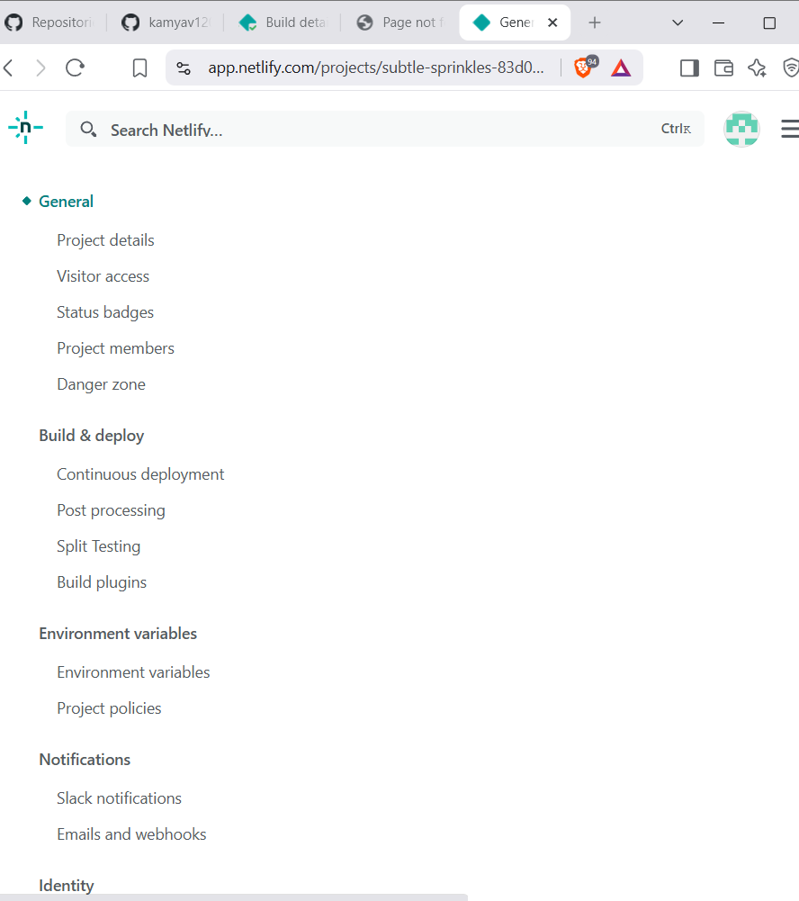

# AbleSpace Caseload Workspace - Product Walkthrough

Pyramid Workspace is a premium full-stack task and caseload management platform designed specifically for therapists to organize tasks, track patient caseload progress, and maintain focus. 

This document walks through the application's design, user experience, core functionalities, and backend architecture.

---

## 🚀 Live Product Links
* **Live Website**: [https://frontend-liart-eight-28.vercel.app](https://frontend-liart-eight-28.vercel.app)
* **GitHub Repository**: [https://github.com/kamyav1203-cmd/ablespace-task-manager](https://github.com/kamyav1203-cmd/ablespace-task-manager)

---

## 🎨 Walkthrough & Key Features

### 1. Unified Caseload Tasks Workspace
The main tasks workspace offers a clean, distraction-free view of all therapeutic tasks. Tasks are automatically grouped by their lifecycle status (**To Do**, **Doing**, **Completed**, and **On Hold**), displaying details like Priority, Assignees, Due Dates, and Custom Category Labels.

* **Features demonstrated**:
  * Collapsible sections for task lists.
  * Haptic priority badge indicators (High/Medium/Low) matching Figma color palettes.
  * Multi-assignee support with round initials-based avatars.
  * Real-time search bar to filter tasks by title instantly on keystroke.

---

### 2. Interactive Layout & Column Customizer
Therapists can customize their workspace dynamically depending on their daily needs. The system supports full switching between a structured **List View** and an agile **Kanban Board View**, as well as toggle options to show/hide specific columns.

* **Features demonstrated**:
  * Seamless layout swapping between list layouts and Kanban boards.
  * **Column visibility toggles**: Instantly show or hide Priority, Members, Due Date, Labels, or Status columns dynamically.
  * Custom dropdown built with click-away listeners and smooth entrance animations.

---

### 3. Integrated Project Workspaces
For larger therapy plans and programmatic deliverables, tasks are grouped under **Projects**. This view displays all high-level goals with their priority status, lead therapist, and target target due dates.

* **Features demonstrated**:
  * Compact listing of current workflows.
  * Direct linking between parent projects and subtask items.
  * Dynamic sorting based on priority levels and lead assignees.

---

### 4. Direct Project Creation & Validation
New projects can be added to the database directly from the workspace UI. The implementation utilizes clean, inline forms that validate user input and immediately update the dashboard views.

* **Features demonstrated**:
  * Inline dropdown selection for project priority levels and lead therapists.
  * Native browser date selector matching database schemas.
  * Double-action confirm/cancel toggles to prevent accidental submissions.

---

### 5. Profile Customizer & Persistence Engine
The profile context menu allows therapists to customize their display preferences. The application supports a full dark theme system along with custom color mode highlights.

* **Features demonstrated**:
  * **Color Modes**: Switch accent color modes (Amber, Blue, Pink) on the fly.
  * **Theme Modes**: Full support for system, light, and dark mode toggles.
  * **Persistence**: Theme settings are stored in `localStorage` to ensure they persist across page refreshes.

---

## 🛠️ Architectural & Backend Details

### 1. Conditionally Adaptive Database Configuration
To resolve the read-only filesystem limits of serverless cloud execution, the NestJS backend uses a dual-driver TypeORM configuration:
* **Local Development**: Runs `better-sqlite3` targeting a local `db.sqlite` file, supporting full data persistence.
* **Serverless Production (Vercel)**: Automatically switches to `sqljs` (WebAssembly-based SQLite) running purely in-memory.
* **Asset Bundling**: Configured `vercel.json` to pack the `sql-wasm.wasm` file into the serverless deployment package automatically.

### 2. Passing Test Suite & Automated CI/CD
A Jest E2E integration test suite verifies the health of core API endpoints.
* **Project Endpoints**: Checks fetching seeded project lists.
* **Task Endpoints**: Validates fetching root-level tasks.
* **Authentication**: Verifies guest auth token generation and validation.
* **Status**: 100% passing tests!
